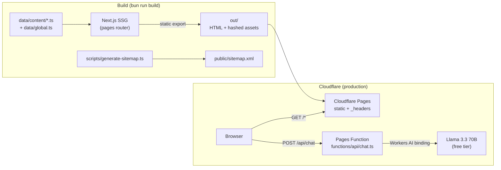

<div align="center">

# bisu.com.np

**Portfolio of Bisu Ghalan** — CS student & security researcher from Nepal
*Telegram bots · CLI tools · full-stack web apps · defensive security*

[](https://bisu.com.np)
[](https://github.com/bisug)


[](https://bisu.com.np)

</div>

---

## 

| Concern | Choice |
| --- | --- |
| Framework | Next.js 16 (Turbopack, pages router) |
| UI | React 19 + Tailwind CSS v4 (CSS-first `@theme` in `styles/main.css`) |
| Types | TypeScript 7 |
| Lint / format | Biome |
| Package manager | Bun |

## 

Everything is prerendered to plain files at build time; the only runtime component is the chat API on Cloudflare.




| Layer | Where | Notes |
| --- | --- | --- |
| Content | `data/content/home.ts`, `data/content/projects.ts` | Single source of truth — pages, JSON-LD, sitemap, and llms.txt all derive from it |
| Layout / chrome | `components/global/`, `components/utility/Page.tsx` | `Page` owns `<Head>` (meta, OG, canonical), nav, PageNav, compact CTA, footer |
| Sections | `components/home/`, `components/projects/` | One file per section |
| SEO/AEO | `components/utility/StructuredData.tsx` | JSON-LD graph: Person, ProfilePage, WebSite, ItemList, FAQPage |
| Deploy artifacts | `public/_headers` + `vercel.json` + `netlify.toml` | Same security headers declared three times — export mode ignores `headers()` in `next.config.ts` |
| Chat backend | `functions/api/chat.ts` | Cloudflare Pages Function only; keys never reach the browser |

## 

```bash
bun install
bun run dev        # http://localhost:3000
```

| Script | Purpose |
| --- | --- |
| `bun run dev` | Dev server |
| `bun run build` | Static export to `out/` (every route prerendered) |
| `bun run start` | Serve the exported `out/` locally |
| `bun run sitemap` | Regenerate `public/sitemap.xml` (run after changing routes or projects) |
| `bun run typecheck` | `tsc --noEmit` |
| `bun run check` | Biome lint + format (writes) |

## 

The build is a **static export** (`output: "export"` in `next.config.ts`): `bun run build` writes a self-contained `out/` directory that any static host can serve. There is no server runtime, no image optimizer, and no API routes in the export itself — images are pre-sized WebP, and `public/sitemap.xml` is generated by `bun run sitemap`.

### Prerequisites

- [Bun](https://bun.sh) (any recent version; dependency versions are pinned in `bun.lock`) and Node ≥ 22 (Netlify pin in `netlify.toml`).
- Optional: `NEXT_PUBLIC_GOOGLE_ANALYTICS=<G-XXXXXXX>` as a build-time env var to enable GA. Without it the site builds fine and just skips analytics.
- The AI chat assistant (see below) only works on **Cloudflare Pages** — on any other host the site is fully functional but the assistant widget reports an error instead of answering.

### Cloudflare Pages (recommended — the chat assistant needs it)

Git-connected: pick the **Next.js (Static HTML Export)** preset, build command `bun run build`, output directory `out`. Or deploy the built directory directly (`wrangler.jsonc` already points at `out`):

```bash
bun run build
bunx wrangler pages deploy out
```

Then enable the AI binding — two things must match:

1. **`wrangler.jsonc`** already has `"ai": { "binding": "AI" }` — nothing to edit.
2. **Dashboard binding:** Cloudflare dashboard → *Workers & Pages* → this Pages project → *Settings* → *Bindings* (older UI: *Functions* → *AI bindings*) → add a **Workers AI** binding named exactly `AI`. Git-connected deploys pick this up from `wrangler.jsonc`; direct `wrangler pages deploy` requires the dashboard binding.

The binding uses Workers AI on the free tier, model `@cf/meta/llama-3.3-70b-instruct-fp8-fast` (see `functions/api/chat.ts`). No API keys involved — the binding is authenticated by the deployment itself, so no secrets are stored anywhere.

### Vercel

Import the repo — Next.js is detected, `out/` is picked up automatically. Or from the CLI:

```bash
bunx vercel deploy --prod
```

### Netlify

`netlify.toml` already sets the build command and publish directory, so a Git-connected site needs no dashboard config. Or from the CLI:

```bash
bunx netlify deploy --prod --dir=out
```

### Test the chat function locally

Workers AI has no local simulation — wrangler proxies to the real API, so you must be logged in (`bunx wrangler login`):

```bash
bun run build
bunx wrangler pages dev out --ai=AI   # serves out/ + functions/ on :8788
curl -X POST localhost:8788/api/chat \
  -H 'content-type: application/json' \
  -d '{"messages":[{"role":"user","content":"hi"}]}'
```

(`bun run start` only serves static files with no `/api/chat` — use `wrangler pages dev` to exercise the function.)

### Post-deploy checklist

- `curl -I https://<domain>/projects` → 200 (clean URLs resolve; a 404 means the host needs `trailingSlash: true` plus matching canonicals).
- `curl -I https://<domain>` → `Strict-Transport-Security`, `X-Frame-Options: DENY`, `Permissions-Policy` present (from `_headers` / `vercel.json` / `netlify.toml`).
- `POST /api/chat` returns JSON (Cloudflare only) — try the site widget.
- Submit `https://<domain>/sitemap.xml` in Google Search Console and Bing Webmaster Tools.


## 

All copy lives in data files — no CMS, no database.

| File | Contents |
| --- | --- |
| `data/content/home.ts` | Skills, experience, education, hobbies |
| `data/content/projects.ts` | Projects and their tags (`/projects/tag/*` pages are generated from these) |
| `data/global.ts` | `SITE_URL` / `SITE_NAME` / `SITE_DESC`, nav routes (also drives PageNav prev/next), social links |

Design tokens (colors, fonts, animations) are defined once in the `@theme` block in `styles/main.css`.

## 

### Add a page

1. Create `pages/<name>.tsx` wrapping content in `<Page currentPage="..." path="/<name>" meta={{...}}>`.
2. Add the route to `routes` in `data/global.ts` — this auto-updates the nav, PageNav prev/next, and sitemap.
3. `bun run sitemap` is run automatically by `bun run build`; also add the page to `public/llms.txt` (manual, for AI crawlers).

### Add a project

1. Append to `projects` in `data/content/projects.ts` (title, desc, tags, GitHub/live links, image name).
2. Drop the screenshot in `public/static/projects/<Name>.png|jpg`, then run `bun run images` — it generates the 1200px and 600px WebP variants (the PNG stays as the og:image source).
3. Update the Projects list in `public/llms.txt`.

### Edit meta / SEO

Per-page title/description live in the `meta` prop of each page. Site-wide values are in `data/global.ts` (`SITE_URL`, `SITE_NAME`, `SITE_DESC`). Structured data is generated in `components/utility/StructuredData.tsx`; the FAQ on `/contact` is in `pages/contact.tsx` and must stay consistent with the visible page content.

### Update security headers

Edit all three in sync: `public/_headers` (Cloudflare/Netlify), `vercel.json`, `netlify.toml`. After deploy, verify with `curl -I https://bisu.com.np`.

### Chat assistant

`components/global/ChatAssistant.tsx` (client) calls `POST /api/chat`, handled by the Cloudflare Pages Function in `functions/api/chat.ts`, which proxies to Workers AI (Llama 3.3 70B). The persona/project facts live in the `SYSTEM_PROMPT` there — update it whenever projects or skills change. Works only on Cloudflare (needs the `AI` binding in `wrangler.jsonc`); on other hosts the assistant degrades to showing an error.


## 

Static export, no third-party runtime dependencies, and every animation is CSS `transform`/`opacity` only (GPU-composited, and frozen for `prefers-reduced-motion`).

| Decision | Why |
| --- | --- |
| Fonts loaded at 400/500/700 sans + 400 mono | Only the weights the design uses; each extra weight is another preloaded file. 300/600/900 in markup resolve to the loaded neighbours. |
| Icons self-hosted in `public/static/icons/tech` | Was 25 requests to `cdn.jsdelivr.net`/`cdn.simpleicons.org` per `/tech-stack` load; now same-origin, cached, and lazy. |
| Screenshots as WebP, two widths | Grid cards request the 600px variant via `srcset`/`sizes` (~87KB for the whole grid instead of ~195KB); detail pages get the 1200px one, `fetchpriority="high"`. |
| Education logos resized to 320px WebP | 152KB of source images became 18KB at the ~120px they render. |
| One shared `IntersectionObserver` | `/tech-stack` alone mounts 30 `Reveal` wrappers; one observer serves them all. |
| Analytics loads `lazyOnload` | gtag no longer competes with hydration. |
| `contain: paint` on the doodle layer | The six drifting doodles can never invalidate layout or paint outside their layer. |

Known floor: ~134KB gzipped JS per page is the React + Next runtime; the site's own code is a few KB of it. Going below that means dropping React (e.g. static HTML + tiny islands), not micro-optimising.

## 

Built on the open-source portfolio template by [Brayden W](https://braydentw.io) ([@BraydenTW](https://github.com/BraydenTW)). His guidelines for the original work — use it as inspiration, don't copy it verbatim, and credit the author — are respected here: the content, design system, and structure have been reworked for this site.

- [Feather Icons](https://feathericons.com) — icon set (self-hosted SVGs in `public/static/icons/`, redrawn to match).
- [Simple Icons](https://simpleicons.org) — tech-stack icons in `public/static/icons/tech/`.
- [Cloudflare Workers AI](https://developers.cloudflare.com/workers-ai/) + [Llama 3.3 70B](https://www.llama.com) — the chat assistant backend.
- [shields.io](https://shields.io) — badges in this README.


